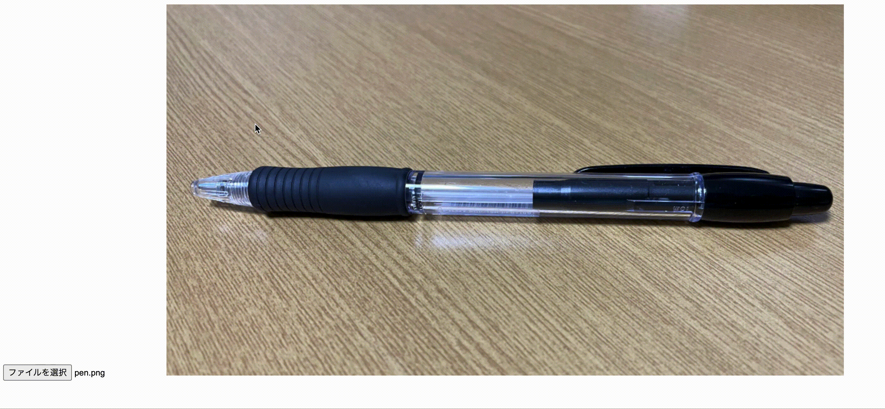

# 概要
easy-mosaicはアップロードした画像の選択した範囲にモザイクをかけるシステムです。



# 構成
- WebとAPIサーバーをdocker-composeで作成しています
- Webサーバーにnginx。APIサーバーにuvicorn + FastAPIを使っています。
- Base64文字列で画像のやりとりを行っています
- 画像処理にOpenCVを使っています

# 動かし方
下記コマンドでコンテナを立ち上げて、`http://localhost:8000/` へアクセスしてください。  

```
$ docker-compose up -d
```